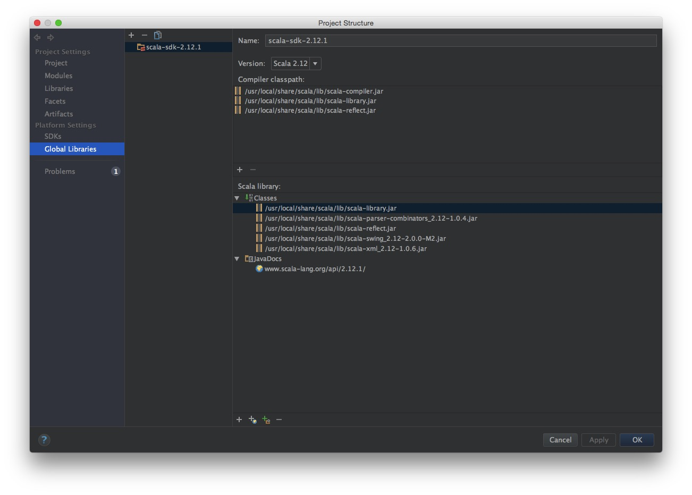

## Scala

#### 简介

    Scala 是一门多范式（multi-paradigm）的编程语言，设计初衷是要集成面向对象编程和函数式编程的各种特性。
    Scala 运行在Java虚拟机上，并兼容现有的Java程序。
    Scala 源代码被编译成Java字节码，所以它可以运行于JVM之上，并可以调用现有的Java类库。

#### 环境安装(Mac OS X)

1. 下载http://www.scala-lang.org/downloads
2. 解压scala-2.12.1.tgz
3. 移动scala-2.12.1目录到/usr/local/share下,如下操作

```
mv scala-2.12.1 scala                   # 重命名 scala 目录
mv ~/scala /usr/local/share             # ~/scala(下载目录)
```

配置环境变量
输入`sudo vim /etc/profile`,在文件末尾添加

```
export PATH=$PATH:/usr/local/share/scala/bin
```
然后执行`source /etc/profile`命令, 最后输入`scala`检查是否安装成功, 如下成功信息：

```
Welcome to Scala 2.12.1 (Java HotSpot(TM) 64-Bit Server VM, Java 1.8.0_45).
Type in expressions for evaluation. Or try :help.
```

#### IntelliJ IDEA构建
1. 首先安装scala插件
2. 接着按住`command + ;` 进入“Project Structure”
3. 选择左边标签“Global Libraries” 新建一个"Scala SDK", 然后scala项目就可以正常运行了, 如下图所示:


#### maven依赖

```
<dependency>
    <groupId>org.scala-lang</groupId>
    <artifactId>scala-library</artifactId>
    <version>2.12.1</version>
</dependency>
<dependency>
    <groupId>org.scala-lang</groupId>
    <artifactId>scala-compiler</artifactId>
    <version>2.12.1</version>
</dependency>
<dependency>
    <groupId>org.scala-lang</groupId>
    <artifactId>scala-reflect</artifactId>
    <version>2.12.1</version>
</dependency>

<plugin>
    <groupId>org.scala-tools</groupId>
    <artifactId>maven-scala-plugin</artifactId>
    <version>2.15.2</version>
    <executions>
        <execution>
            <goals>
                <goal>compile</goal>
                <goal>testCompile</goal>
            </goals>
        </execution>
    </executions>
</plugin>
```

#### 参考

环境安装: http://www.runoob.com/scala/scala-install.html

maven构建: http://www.cnblogs.com/zhoudayang/p/5027307.html

匿名函数: http://docs.scala-lang.org/tutorials/tour/anonymous-function-syntax.html